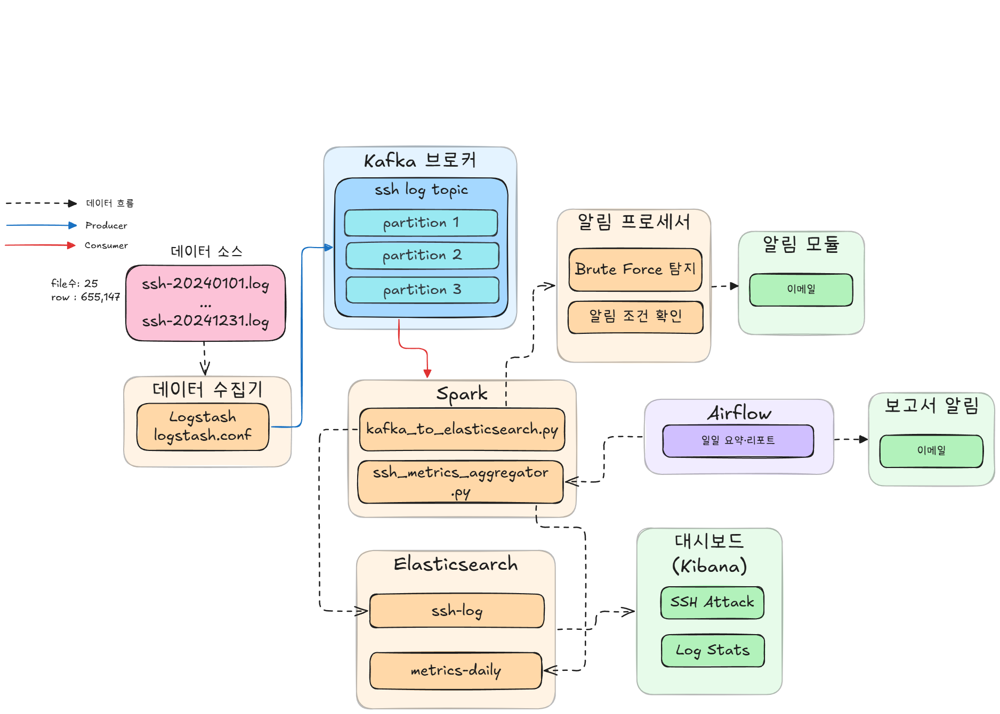

# log_monitor
서버ㆍ어플리케이션 로그와 시스템 자원 사용량을 **실시간**으로 수집·가공·저장하여 운영 상태를 시각화하는 데이터 엔지니어링 프로젝트입니다. “운영 중 장애를 조기에 감지하고, 근본 원인을 분석하기 쉬운 로그 플랫폼”을 목표로 합니다.

## 목차
1. [프로젝트 Goal](#프로젝트-goal)
2. [시스템 아키텍처](#시스템-아키텍처)
3. [데이터셋](#데이터셋)
4. [데이터 수집](#데이터-수집)
5. [Kafka 구성](#kafka-구성)
6. [데이터 처리](#데이터-처리)
7. [데이터 저장](#데이터-저장)
8. [리포팅 & 알림](#리포팅--알림)
9. [장애 처리 및 운영](#장애-처리-및-운영)
10. [성능 및 테스트](#성능-및-테스트)
11. [데모](#데모)

---

## 프로젝트 Goal
- 다중 서버 SSH 로그를 중앙 집중식으로 모니터링
- 실시간 이상 징후(로그인 실패 폭주 등) 탐지 후 이메일 알림
- Kibana 대시보드로 검색·시각화, Airflow 일일 리포트 자동 발송

## 시스템 아키텍처


## 데이터셋
- **OpenSSH** 서버 로그 (형식: `/var/log/auth.log`)
- 샘플 데이터: [loghub/OpenSSH](https://github.com/logpai/loghub)
- SSH로 접근한 모든 내역, 연도는 임의 생성
```bash
Dec 10 06:55:46 LabSZ sshd[24200]: reverse mapping checking getaddrinfo for ns.marryaldkfaczcz.com [173.234.31.186] failed - POSSIBLE BREAK-IN ATTEMPT!
Dec 10 06:55:46 LabSZ sshd[24200]: Invalid user webmaster from 173.234.31.186
Dec 10 06:55:46 LabSZ sshd[24200]: input_userauth_request: invalid user webmaster [preauth]
```

## 데이터 수집
| 단계 | 도구 | 설명 |
| --- | --- | --- |
| 1 | Logstash File Input | `/data/ssh-*.log` 파일 read |
| 2 | Grok & Ruby Filter | 타임스탬프 변환, 필드 추출, fingerprint(`row_hash`) 생성 |
| 3 | Kafka Output | `ssh-log` 토픽(JSON)으로 전송 |

## 기술 사용 이유
| 기술 | 선정 이유 |
| --- | --- |
| **ELK Stack** | - 로그 수집·저장·시각화를 위한 통합 솔루션<br>- Logstash의 강력한 로그 파싱 기능<br>- Elasticsearch의 빠른 검색과 집계<br>- Kibana의 직관적인 대시보드 |
| **Apache Kafka** | - 높은 처리량과 낮은 지연시간<br>- 메시지 영속성과 안정성<br>- 파티셔닝을 통한 병렬처리<br>- 장애 복구와 고가용성 |
| **Apache Spark** | - 대용량 데이터의 병렬 처리<br>- Structured Streaming으로 실시간 처리<br>- 메모리 기반 빠른 연산 속도<br>- SQL, ML 등 다양한 라이브러리 |

## Kafka 구성
| 항목 | 설정값 | 설명 |
| --- | --- | --- |
| **토픽** | `ssh-log` | SSH 로그 데이터 저장용 메인 토픽 |
| **파티션** | 3개 | 병렬 처리 및 확장성을 위한 파티션 수 |
| **복제 계수** | 3 | 데이터 안정성을 위한 복제본 수 |
| **메시지 키** | `row_hash` | 중복 방지를 위한 고유 식별자, `source_path + event_time + message` 조합 |
| **데이터 형식** | JSON | Logstash에서 전송하는 구조화된 로그 데이터 |

**ssh-log 예시**


## 데이터 처리 (Spark)

### 클러스터 구성
| 컴포넌트 | 개수 | 리소스 | 역할 |
| --- | --- | --- | --- |
| **Master** | 1개 | - | 클러스터 관리, 작업 스케줄링 |
| **Worker** | 1개 | 1GB RAM, 2 Cores | 실제 작업 실행, Executor 호스팅 |
| **Executor** | 1개 | 1GB RAM, 2 Cores | Spark 작업 실행 엔진 |

### 처리 모드
| 모드 | Trigger | 엔진 | 기능 |
| --- | --- | --- | --- |
| 실시간 | 5초 마이크로 배치 | Spark Structured Streaming | JSON 파싱, 파생 필드(`user`, `ip`), 이상탐지(로그인 실패 N회) |
| 배치 | 일간 Airflow DAG | Spark | 지표 집계 리포트 생성 |

### 리소스 최적화
| 설정 | 값 | 목적 |
| --- | --- | --- |
| **Worker Memory** | 1GB | 워커당 사용 가능 메모리 |
| **Worker Cores** | 2 | 워커당 CPU 코어 수 |
| **Executor Memory** | 1GB | 실행자당 메모리 할당 |
| **Executor Cores** | 2 | 실행자당 CPU 코어 수 |
| **Shuffle Partitions** | 1 | 단일 노드 최적화 |
| **Max Offsets Per Trigger** | 10000 | 배치 크기 제한 |


## 데이터 저장 (Elasticsearch)
| 인덱스 | 기능 |
| --- | --- |
| `ssh-log` | 원본+파싱 로그 저장 |
| `metrics-daily` | 일간 집계 지표 |

**ssh-log**
| 필드 | 타입 | 설명 |
| --- | --- | --- |
| `@timestamp` | date | 로그 수집 시간 |
| `error_type` | keyword | 오류 유형 |
| `event_time` | date | 로그 발생 시간 |
| `host_name` | keyword | 서버 호스트명 |
| `user` | keyword | 접근 사용자 |
| `ip` | ip | 접근 IP |
| `port` | integer | 접근 포트 |
| `log_level` | keyword | 로그 레벨 (INFO, ERROR, WARN) |
| `log_type` | keyword | 오류 유형 (ssh, ...) |
| `message` | text | 로그 메시지 |
| `row_hash` | keyword | 로그 해시 값 (message + raw경로 + 로그 발생 시간) |
| `source_file` | keyword | 로그 파일명 |
| `source_path` | keyword | 로그 파일 경로 |

**metrics-daily**
| 필드 | 타입 | 설명 |
| --- | --- | --- |
| `metric_date` | date | 집계 기준일 (YYYY-MM-DD) |
| `total_logs` | long | 하루 전체 로그 수 |
| `error_count` | long | log_level='ERROR' 건수 |
| `unique_ips` | long | 서로 다른 IP 개수 |
| `peak_hour` | integer | 24개 시간대 중 최대 건수 시간 |
| `peak_hour_logs` | long | 피크 시간대 로그 건수 |
| `top_ip_list` | nested | [{"ip":"1.2.3.4","cnt":123}, ...] 상위 3개 IP |
| `brute_force_ips` | long | 브루트포스 의심 IP 개수 (실패 10회 이상) |
| `top_brute_list` | nested | [{"ip":"1.2.3.4","cnt":123}, ...] 상위 3개 브루트포스 IP |
| `created_at` | date | 집계 생성 시간 |

## 리포팅 & 알림
- **실시간 알림** (`spark/kafka_to_elasticsearch.py`): Spark `foreachBatch`로 브루트포스 탐지 시 SMTP 발송
- **일간 리포트** (`airflow/dags/daily_ssh_report_dag.py`): 매일 09:00 KST, 일간 리포트 생성 후 이메일 전송

## 장애 처리 및 운영

### 장애 처리 전략
| 컴포넌트 | 장애 유형 | 처리 방법 |
| --- | --- | --- |
| **Kafka** | 브로커 장애 | `replication.factor=3`, `min.insync.replicas=2` |
| **Spark** | 애플리케이션 장애 | 체크포인트 기반 재시작, `es.mapping.id=row_hash` |
| **Logstash** | 프로세스 장애 | sincedb 기반 오프셋 복구 |
| **Elasticsearch** | 노드 장애 | 단일 노드 구성, 데이터 백업 |

### Retry 전략
| 서비스 | 재시도 횟수 | 간격 | 백오프 |
| --- | --- | --- | --- |
| **Airflow DAG** | 1회 | 5분 | 고정 |
| **Spark Streaming** | 무한 | 즉시 | 체크포인트 기반 |

### 알림 전송
- **실시간 알림**: 브루트포스 탐지 시 즉시 SMTP 발송
- **성공 알림**: 일간 리포트 생성 완료 시 HTML 이메일
- **실패 알림**: DAG 실패 시 상세 오류 정보 포함 이메일
- **수신자**: 환경변수 `REPORT_RECIPIENTS`로 다중 수신자 지원

### 모니터링
- **Healthcheck**: 모든 컨테이너 30초 간격 상태 확인
- **로그 모니터링**: 각 서비스별 로그 수집 및 분석
- **메트릭 수집**: Kafka lag, Elasticsearch 성능 지표

## 성능 및 테스트
| 지표 | 값 | 설명 |
| --- | --- | --- |
| **logstash 처리 시간** | 71.8초 | 655,147개 이벤트 kafka로 보내는데 걸린 시간(초당 약 9000개) |


## 데모
```bash
# 1) 환경 기동
$ docker-compose up -d

# 2) 샘플 로그 삽입
$ ./create_ssh_topic.sh           # 토픽 생성
$ docker exec -it logstash logstash -f /pipeline/logstash.conf

# 3) Spark 스트리밍 시작
$ ./spark/spark_kafka_ssh_to_es.sh

# 4) Kibana ▶ http://localhost:5601  대시보드 확인
```

## 향후 개선 사항
- 여러 서버의 log데이터 및 log종류 확장
- 비정상 이메일 탐지 호출 로직 개선
- 시각화 기반 alert
